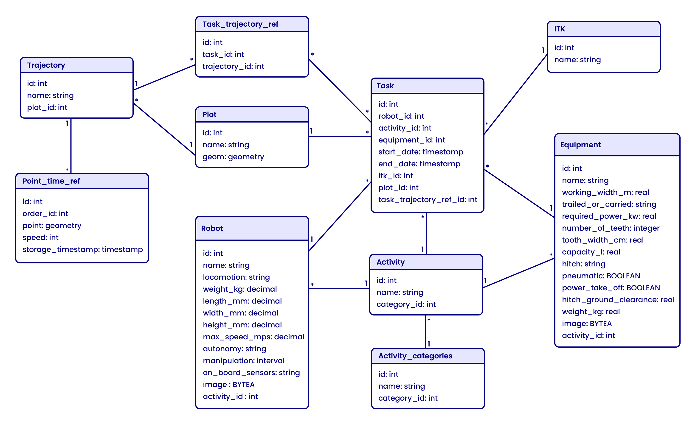

# Application Web pour la planification des tâches des robots

Cette application web permet aux utilisateurs de planifier et de gérer les tâches des robots agricoles autonomes. De plus, elle prend en charge les opérations CRUD (Créer, Lire, Mettre à jour, Supprimer) pour les robots, les équipements et les activités. Elle gère également les géodonnées, y compris les parcelles et les trajets des robots. L'objectif est d'améliorer les performances des robots en agriculture, de réduire la main-d'œuvre humaine et d'optimiser l'utilisation des ressources.

## Features

- Planification des tâches pour les robots
- Consultation du calendrier des tâches
- Visualisation de la carte (parcelles et trajets)
- Gestion des robots
- Gestion des équipements
- Gestion des parcelles
- Gestion des trajets
- Gestion des activités agricoles

## Pile technologique

**Client:** Nextjs (React), Zustand (gestion d'état), Mapbox, TailwindCSS et Shadcn/ui (bibliothèque de composants UI)

**Serveur:** Nodejs, Express

**Base de données:** PostgreSQL

## Structure du projet

```
├── client                   # Frontend Next.js
│   ├── app                  # Répertoire App Router
│   │   ├── (activity)       # Composants/pages liés aux Activités
│   │   ├── (equipment)      # Composants/pages liés aux Équipements
│   │   ├── (itk)            # Composants/pages liés à ITK
│   │   ├── (plot)           # Composants/pages liés aux Parcelles
│   │   ├── (robots)         # Composants/pages liés aux Robots
│   │   ├── (tasks)          # Composants/pages liés à la gestion des Tâches
│   │   ├── (trajectory)     # Composants/pages liés aux Trajets
│   │   ├── calendar         # Composants/pages de la vue Calendrier
│   │   ├── favicon.ico      # Favicon pour l'application web
│   │   ├── globals.css      # Styles globaux pour l'application
│   │   ├── layout.tsx       # Composant de mise en page racine pour l'application
│   │   └── page.tsx         # Composant de la page principale pour l'application
│   ├── components           # Composants UI réutilisables (Pages Router)
│   ├── lib                  # Fonctions/utilitaires auxiliaires
│   ├── public               # Actifs statiques (images, etc.)
│   ├── Dockerfile           # Configuration Docker
│   └── ...                  # Autres fichiers du projet (e.g., .gitignore, package-lock.json)
├── server                   # Backend Node.js
│   ├── controllers          # Logique des endpoints API (gestion des requêtes)
│   ├── routes               # Définition des routes API
│   ├── services
│   │   └── db.js            # Configuration de la base de données
│   ├── utils                # Fonctions utilitaires (helpers)
│   ├── Dockerfile           # Configuration Docker
│   ├── server.js            # Point d'entrée principal du serveur
│   └── ...                  # Fichiers supplémentaires (e.g., .gitignore, package-lock.json)
└── docker-compose.yml       # Définit et configure les services Docker pour le projet
```

## Installation & Configuration

**1. Cloner le dépôt:**

```bash
git clone https://github.com/ayoubhatmi/inrae-robots-planning.git
cd inrae-robots-planning
```

**2. Configurer les variables d'environnement:**

Créez un fichier .env dans les répertoires client et serveur, et remplissez les valeurs selon votre environnement.

**Backend (.env dans serveur)**

    PG_HOST=
    PG_PORT=
    PG_USER=
    PG_PASSWORD=
    PG_DATABASE=

**Frontend (.env dans client)**

    NEXT_PUBLIC_API_BASE_URL=http://api:3001
    NEXT_PUBLIC_MAPBOX_ACCESS_TOKEN=

## Lancer l'application

### En utilisant Docker

**1. Construire et démarrer les services :**

```bash
docker-compose up --build
```

The application should now be accessible at http://localhost:3000.

### Sans Docker

**1. Configuration du Backend :**

```bash
cd server
npm install
npm run dev
```

**2. Configuration du Frontend :**

```bash
cd client
npm install
npm run dev
```

L'application devrait maintenant être accessible à l'adresse http://localhost:3000.

## Documentation de l'API

La documentation de l'API pour ce projet est disponible via Swagger UI. Vous pouvez y accéder localement en visitant l'URL suivante dans votre navigateur :

http://localhost:3001/api-docs/

Cette documentation fournit des détails sur tous les points de terminaison disponibles, les formats de requêtes/réponses, et d'autres informations pertinentes sur l'API.

## Notes supplémentaires

- Assurez-vous que Docker et Docker Compose sont installés sur votre machine.
- Les variables d'environnement doivent être correctement définies dans les fichiers .env avant de lancer l'application.
- **Arrêter l'application:** Utilisez `docker-compose down` pour arrêter et supprimer les conteneurs.

## Schéma relationnel de la base de données

Ci-dessous, le schéma relationnel de la base de données pour l'application. Il décrit les relations entre les différentes tables utilisées pour gérer les robots, les équipements, les activités, les parcelles et les trajets.


